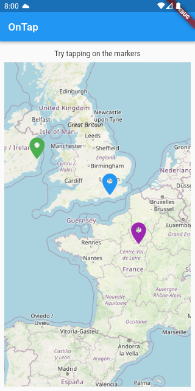
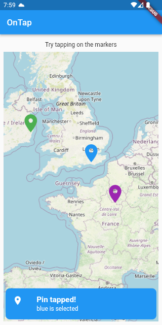
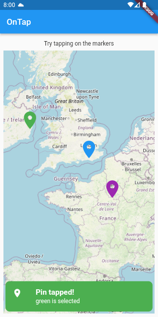
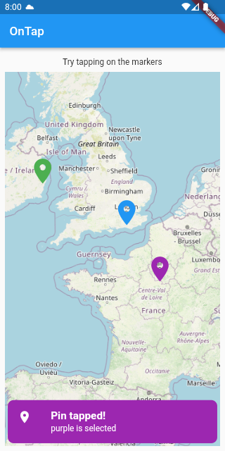

# flutter_map_popup_message

This Flutter program is to demo how to show a popup message on top of the map when a pin is selected

## Packages required
- flutter_map
- latlong2
- provider

# Screenshots

